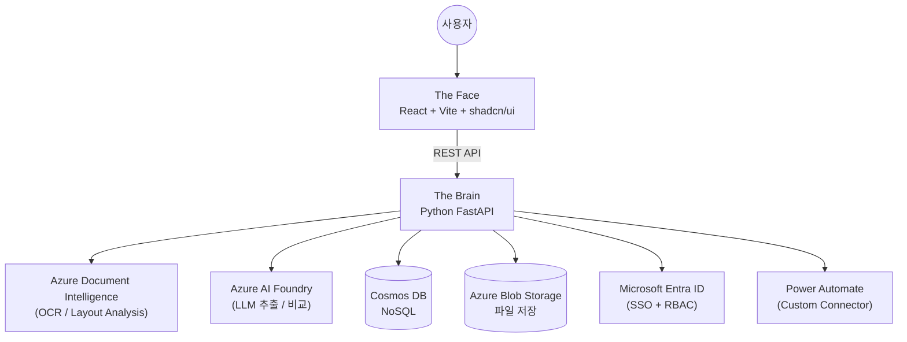
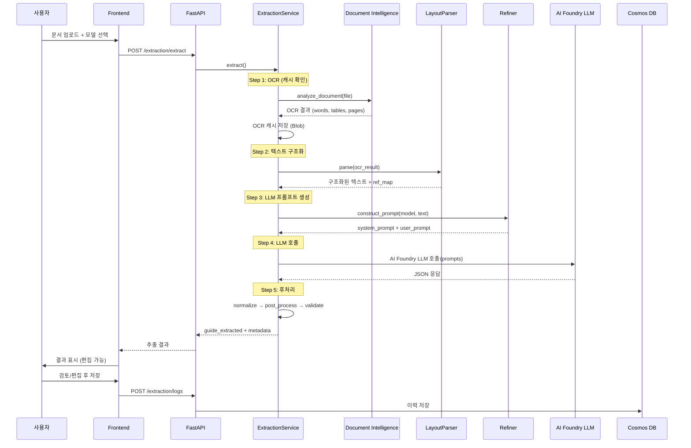
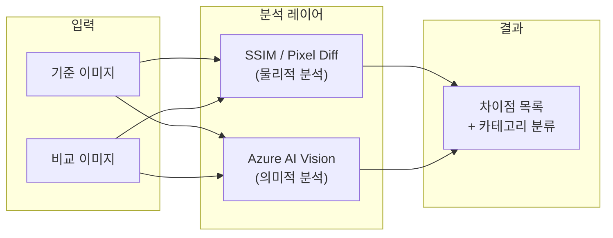
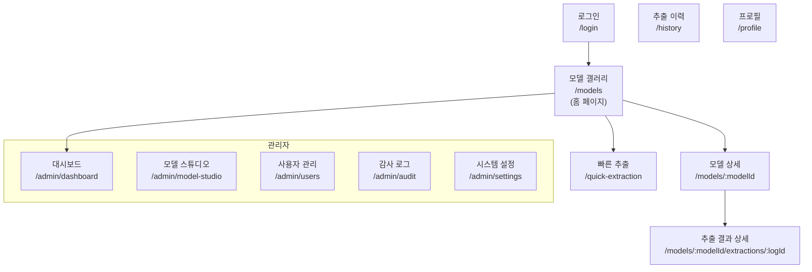
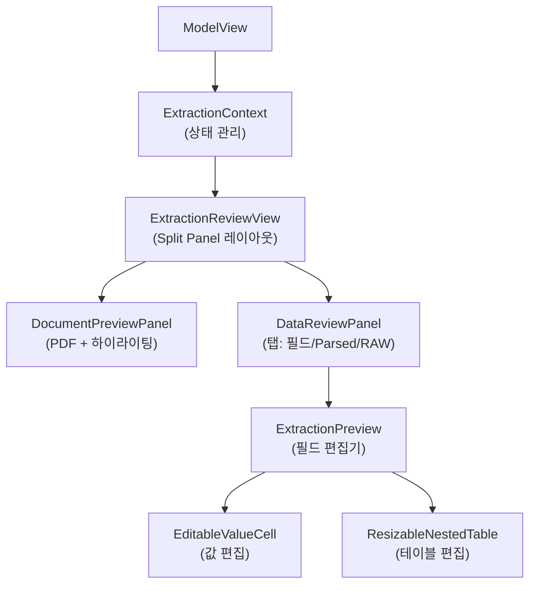
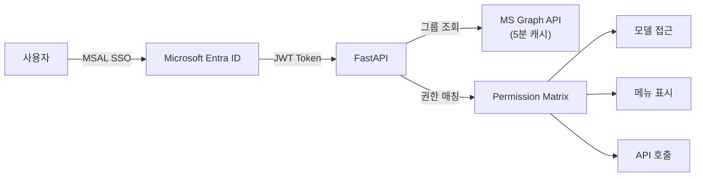

# DAOM 시스템 문서
> **Document Automation & Orchestration Management**
> 비정형 문서(PDF, 이미지)를 구조화된 데이터로 변환하는 Enterprise AI 플랫폼

---

## 1. 시스템 개요

DAOM은 Azure AI Document Intelligence(OCR)와 Azure AI Foundry(LLM)를 결합하여, 문서에서 데이터를 추출하고, 문서 간 비교를 수행하며, 추출 결과를 사후 검증·편집할 수 있는 플랫폼입니다.



### 1.1 기능 목록

#### 📄 데이터 추출
| 기능 | 설명 | 상태 |
|------|------|------|
| **스키마 기반 추출** | 모델에 정의된 필드를 문서에서 자동 추출 | ✅ 운영 |
| **테이블 모드 추출** | `data_structure: "table"` — 표 형태 데이터를 행 배열로 추출 | ✅ 운영 |
| **다중 문서 추출** | 여러 파일을 하나의 컨텍스트로 결합하여 추출 | ✅ 운영 |
| **OCR 캐싱** | 파일 해시 기반 Blob 캐시로 재추출 시 OCR 스킵 | ✅ 운영 |
| **Beta 최적화 파이프라인** | LayoutParser + 인덱스 참조로 토큰 절약 | ✅ 운영 |
| **PDF 하이라이팅** | 추출 값의 원문 위치를 PDF에서 강조 표시 | ✅ 운영 |
| **인라인 편집** | 추출 결과를 UI에서 직접 수정 후 저장 | ✅ 운영 |
| **테이블 편집기** | 테이블 모드 결과를 표 형태로 편집 (ResizableNestedTable) | ✅ 운영 |
| **엑셀 다운로드** | 추출 결과를 Excel 파일로 내보내기 | ✅ 운영 |
| **빠른 추출** | 모델 선택 없이 즉시 문서 추출 | ✅ 운영 |
| **추출 재시도** | 동일 문서에 대해 재추출 실행 | ✅ 운영 |
| **Webhook 자동 호출** | 추출 완료 후 외부 URL로 결과 POST | ✅ 운영 |
| **참조 데이터 그라운딩** | 고객 코드, 매핑 테이블 등 참조 데이터를 LLM 컨텍스트에 포함 | ✅ 운영 |
| **사전 정규화 (Dictionary)** | Azure AI Search 기반 사전으로 추출값 자동 정규화 (항구코드, 운임코드 등) | ✅ 운영 |
| **행 확장 (Transform)** | 그룹 코드를 개별 행으로 확장 (예: AS1 → [NINGBO, QINGDAO, ...]) | ✅ 운영 |
| **모델별 LLM 선택** | 헤더 정규화(`mapper_llm`)와 추출(`extractor_llm`) 각각 다른 LLM 배포 선택 가능 | ✅ 운영 |
| **Vision 직접 추출** | OCR 스킵, GPT Vision으로 이미지 기반 추출 (`use_vision_extraction`) | ✅ 운영 |
| **Excel 직접 추출 (SQL)** | Pandas 기반 Excel 파싱 → LLM 스키마 매핑 → 데이터 실행 | ✅ 운영 |
| **Blob Hydration** | 1.5MB 초과 데이터 자동 Blob 오프로드 및 API 반환 시 복원 | ✅ 운영 |
| **토큰 감사** | tiktoken 기반 LLM 프롬프트 토큰 사용량 분석 유틸리티 | ✅ 운영 |

#### 🔍 문서 비교
| 기능 | 설명 | 상태 |
|------|------|------|
| **1:N 이미지 비교** | 기준 이미지와 여러 비교 이미지 간 차이점 분석 | ✅ 운영 |
| **SSIM/Pixel 분석** | 물리적 구조 차이 감지 (해상도, 압축 노이즈 필터) | ✅ 운영 |
| **Azure AI Vision 분석** | 의미적 차이 감지 (텍스트, 로고, 레이아웃) | ✅ 운영 |
| **카테고리 분류** | 차이점을 사용자 정의 카테고리로 분류 | ✅ 운영 |
| **무시 규칙** | 위치/글꼴/색상/압축 노이즈 등 필터링 | ✅ 운영 |
| **신뢰도 임계값** | 0.0~1.0 범위 민감도 설정 | ✅ 운영 |

#### ⚙️ 관리 (Admin)
| 기능 | 설명 | 상태 |
|------|------|------|
| **Model Studio** | 추출/비교 모델 스키마 편집 (필드, 규칙, 참조 데이터) | ✅ 운영 |
| **모델 갤러리** | 전체 모델 카드형 목록 (홈 페이지) | ✅ 운영 |
| **모델 활성/비활성** | `is_active` 토글로 메뉴에서 숨기기 | ✅ 운영 |
| **사용자 관리** | 사용자 CRUD, 대량 등록, 사전 등록 | ✅ 운영 |
| **그룹 기반 RBAC** | Entra ID 그룹 연동, 모델별 접근 제어 | ✅ 운영 |
| **감사 로그** | 모든 API 호출 추적 (토큰 사용량 포함) | ✅ 운영 |
| **대시보드** | 추출 통계 (모델별, 기간별) | ✅ 운영 |
| **메뉴 관리** | 권한 기반 동적 메뉴 구성 | ✅ 운영 |
| **사이트 설정** | 사이트 전체 설정 (LLM 파라미터 등) | ✅ 운영 |
| **Beta 기능 토글** | 모델별 Beta 파이프라인 활성화 | ✅ 운영 |

#### 🔗 통합 (Integration)
| 기능 | 설명 | 상태 |
|------|------|------|
| **Power Automate 커넥터** | Swagger 2.0 Custom Connector (추출/비교/모델 조회) | ✅ 운영 |
| **Entra ID SSO** | MSAL 기반 싱글 사인온 | ✅ 운영 |
| **MS Graph API** | 그룹 멤버십 조회 (5분 캐시) | ✅ 운영 |

---

### 1.2 핵심 입출력 요약
| 기능 | 설명 | 주요 입력 | 주요 출력 |
|------|------|-----------|-----------|
| **데이터 추출** | PDF/이미지에서 스키마 기반 필드 추출 | 문서 + 추출 모델 | JSON (guide_extracted) |
| **문서 비교** | 2개 문서 간 시각적·의미적 차이 분석 | 기준/비교 이미지 | 차이점 목록 + 카테고리 |
| **관리 거버넌스** | 모델 설계, 사용자 권한, 감사 로그 | 관리자 조작 | RBAC, 감사 추적 |

---

## 2. 기술 스택

| 레이어 | 기술 | 비고 |
|--------|------|------|
| **Frontend** | React 18, Vite, TypeScript | SPA (Single Page App) |
| **UI Library** | Tailwind CSS, shadcn/ui (Radix) | Microsoft Fabric 스타일 |
| **Backend** | Python 3.11+, FastAPI, Pydantic v2 | 비동기 API 서버 |
| **Database** | Azure Cosmos DB (NoSQL) | 모델, 추출 이력, 사용자 |
| **File Storage** | Azure Blob Storage | 원본 문서, OCR 캐시 |
| **AI / OCR** | Azure Document Intelligence | prebuilt-layout 모델 |
| **AI / LLM** | Azure AI Foundry (`AZURE_AIPROJECT_ENDPOINT`, fallback: legacy Azure OpenAI) | 추출 + 비교 + 채팅 |
| **Auth** | Microsoft Entra ID (MSAL) | SSO + 그룹 기반 RBAC |
| **Deployment** | Azure Container Apps (ACA) | GitHub Actions CI/CD |
| **Integration** | Power Automate Custom Connector | Swagger 2.0 기반 |

---

## 3. 프로젝트 구조

```
daom/
├── backend/
│   └── app/
│       ├── api/
│       │   ├── api.py              # 라우터 집합 (14개 endpoint 그룹)
│       │   └── endpoints/          # 개별 API 엔드포인트
│       │       ├── documents.py        # 문서 업로드/조회
│       │       ├── extraction_preview.py # 추출 실행/미리보기 (핵심)
│       │       ├── models.py           # 추출 모델 CRUD
│       │       ├── users.py            # 사용자 관리
│       │       ├── groups.py           # 그룹/권한 관리
│       │       ├── audit.py            # 감사 로그
│       │       ├── menus.py            # 메뉴 구성
│       │       ├── prompts.py          # 프롬프트 관리
│       │       ├── power_automate.py   # Power Automate 커넥터
│       │       ├── site_settings.py    # 사이트 설정
│       │       ├── settings.py         # 시스템 설정
│       │       ├── templates.py        # 템플릿
│       │       ├── graph.py            # Microsoft Graph
│       │       ├── transformation.py   # 데이터 변환
│       │       └── extraction/logs.py  # 추출 이력 조회
│       ├── core/
│       │   ├── config.py           # 환경 변수 / 설정
│       │   ├── auth.py             # Entra ID 인증
│       │   ├── permissions.py      # 권한 체크 로직
│       │   ├── group_permission_utils.py # 그룹별 권한 유틸
│       │   ├── rate_limit.py       # API Rate Limiting
│       │   └── enums.py            # 상수 / 열거형
│       ├── schemas/
│       │   ├── model.py            # ExtractionModel, FieldDefinition
│       │   └── document.py         # Document 스키마
│       ├── services/               # 비즈니스 로직 (35+ 서비스)
│       │   ├── extraction_service.py   # 핵심: OCR→LLM 추출 파이프라인
│       │   ├── extraction/             # 추출 서브패키지
│       │   │   ├── beta_pipeline.py        # Beta: Designer→Engineer→Aggregator
│       │   │   ├── sql_extraction.py       # Excel/Pandas 기반 추출
│       │   │   ├── rule_engine.py          # Dictionary 정규화 + 검증
│       │   │   ├── transform_engine.py     # 그룹코드→행 확장
│       │   │   ├── index_engine.py         # 인덱스 기반 좌표 매칭
│       │   │   ├── excel_parser.py         # Excel→Markdown 변환
│       │   │   ├── vision_extraction.py    # GPT Vision 직접 추출
│       │   │   └── advanced_table_pipeline.py # 테이블 직접 매핑
│       │   ├── beta_chunking.py        # Beta: 최적화된 단일호출 추출
│       │   ├── chunked_extraction.py   # Legacy: 청킹 추출
│       │   ├── refiner.py              # LLM 프롬프트 생성 엔진
│       │   ├── layout_parser.py        # OCR 결과 → 구조화된 텍스트
│       │   ├── llm.py                  # OpenAI API 호출 래퍼 + 모델 목록 조회
│       │   ├── doc_intel.py            # Document Intelligence 호출
│       │   ├── extraction_jobs.py      # 추출 작업 관리
│       │   ├── extraction_logs.py      # 추출 이력 CRUD
│       │   ├── comparison_service.py   # SSIM+Vision+LLM 문서 비교
│       │   ├── dictionary_service.py   # Azure AI Search 사전 관리
│       │   ├── pixel_diff.py           # 이미지 비교 (SSIM)
│       │   ├── vision_service.py       # Azure AI Vision 비교
│       │   ├── hydration.py            # Blob 오프로드 데이터 복원
│       │   ├── token_audit.py          # tiktoken 토큰 사용량 분석
│       │   ├── user_service.py         # 사용자 관리
│       │   ├── group_service.py        # 그룹 관리
│       │   ├── permission_service.py   # RBAC
│       │   ├── audit.py                # 감사 추적
│       │   ├── menu_service.py         # 메뉴 관리
│       │   ├── prompt_service.py       # 프롬프트 저장/조회
│       │   ├── storage.py              # Blob Storage CRUD
│       │   ├── file_storage.py         # Blob Storage 유틸
│       │   ├── splitter.py             # 다중 문서 분리
│       │   ├── template_chat.py        # 템플릿 채팅
│       │   ├── graph_service.py        # MS Graph API
│       │   ├── stats_service.py        # 통계
│       │   ├── startup_service.py      # 서버 시작 초기화
│       │   └── webhook.py              # 웹훅 발송
│       └── db/                     # DB 연결
├── frontend/
│   └── src/
│       ├── App.tsx                 # 라우팅 (12개 페이지)
│       ├── main.tsx                # 앱 진입점
│       ├── auth/                   # MSAL 인증
│       ├── components/             # 공용 UI 컴포넌트 (63개)
│       │   ├── Sidebar.tsx             # 메인 네비게이션
│       │   ├── ModelGallery.tsx         # 모델 갤러리 (홈)
│       │   ├── ModelView.tsx            # 모델 상세 (추출/비교)
│       │   ├── ModelStudio.tsx          # 모델 스키마 편집
│       │   ├── AdminSettings.tsx        # 시스템 설정
│       │   ├── UserManagement.tsx       # 사용자 관리
│       │   ├── AuditLogViewer.tsx       # 감사 로그
│       │   └── ui/                     # shadcn 기본 컴포넌트
│       ├── features/               # 기능별 모듈
│       │   ├── verification/           # 추출 결과 검증 (핵심 UI)
│       │   │   ├── components/
│       │   │   │   ├── ExtractionReviewView.tsx  # 메인 리뷰 (PDF+데이터)
│       │   │   │   ├── ExtractionPreview.tsx     # 추출 필드 편집기
│       │   │   │   ├── DataReviewPanel.tsx       # 탭 패널 (필드/RAW 등)
│       │   │   │   └── DocumentPreviewPanel.tsx  # PDF 뷰어 + 하이라이트
│       │   │   └── context/
│       │   │       └── ExtractionContext.tsx     # 추출 상태 관리
│       │   ├── extraction/             # 추출 이력
│       │   ├── comparison/             # 문서 비교
│       │   └── quick/                  # 빠른 추출
│       ├── types/                  # TypeScript 타입 정의
│       │   ├── model.ts                # Model, Field, BetaFeatures
│       │   ├── extraction.ts           # 추출 관련 타입
│       │   └── template.ts             # 템플릿 타입
│       ├── i18n/                   # 다국어 (ko, en)
│       ├── hooks/                  # React 훅
│       ├── lib/                    # 유틸리티
│       └── utils/                  # 공용 함수
├── docs/                       # 문서
├── scripts/                    # 배포/유틸 스크립트
└── .github/workflows/          # CI/CD
```

---

## 4. 핵심 데이터 모델

### 4.1 ExtractionModel (추출 모델)

추출/비교 작업의 **설정 단위**. 관리자가 Model Studio에서 생성·편집합니다.

```python
class ExtractionModel:
    id: str                           # 고유 ID
    name: str                         # 모델명 (예: "인보이스", "BL")
    description: str                  # 설명
    model_type: str                   # "extraction" | "comparison"
    data_structure: str               # "data" (JSON) | "table" (표) | "report" (문서)

    # 추출 스키마
    fields: List[FieldDefinition]     # 추출 대상 필드 목록
    global_rules: str                 # 전체 출력 규칙 (자연어)
    reference_data: Dict              # 참고 데이터 (코드 매핑 등)

    # LLM 설정 (2026-03 추가)
    mapper_llm: Optional[str]         # 헤더 정규화용 LLM 배포명 (e.g. gpt-4o-mini)
    extractor_llm: Optional[str]      # 메인 추출용 LLM 배포명 (기본값 오버라이드)
    temperature: float = 0.0          # LLM Temperature

    # 비교 설정
    comparison_settings: ComparisonSettings  # 신뢰도, 무시 규칙, 카테고리

    # 후처리 엔진 (2026-03 추가)
    dictionaries: List[str]           # Dictionary 카테고리 목록 (e.g. ["port", "charge"])
    transform_rules: List[Dict]       # 행 확장 규칙 (그룹코드 → 개별 행)
    excel_columns: List[ExcelExportColumn]  # 엑셀 내보내기 열 정의

    # 기능 토글
    beta_features: Dict[str, bool]    # use_optimized_prompt, use_vision_extraction, use_multi_table_analyzer
    is_active: bool                   # 메뉴 표시 여부
    webhook_url: str                  # 추출 완료 후 자동 호출 URL
    allowedGroups: List[str]          # 접근 허용 그룹
```

### 4.2 FieldDefinition (필드 정의)

```python
class FieldDefinition:
    key: str                  # 필드 키 (예: "shipper_name")
    label: str                # 표시명 (예: "송하인명")
    description: str          # 추출 대상 정의 (자연어, LLM 프롬프트에 포함)
    rules: str                # 출력 보정 규칙 (자연어, LLM 프롬프트에 포함)
    type: str                 # "string" | "number" | "date" | "array"
    dictionary: Optional[str] # 사전 매핑 카테고리 (e.g. "port")
    required: bool = False    # 필수 추출 여부
    validation_regex: str     # 값 검증 정규식 (e.g. ^[A-Z0-9]+$)
    sub_fields: List[Dict]    # 테이블 하위 필드 정의
```

### 4.3 추출 결과 구조 (guide_extracted)

```json
// data_structure = "data" (일반 모드)
{
    "shipper_name": {
        "value": "ABC Corp",
        "confidence": 0.95,
        "source_text": "Shipper: ABC Corp",
        "bbox": [0.1, 0.2, 0.5, 0.3],
        "page_number": 1
    },
    "invoice_date": {
        "value": "2025-01-15",
        "confidence": 0.88,
        "source_text": "Date: 2025/01/15"
    }
}

// data_structure = "table" (테이블 모드)
[
    { "POD": "USCHS", "Rate_USD": "1440", "Container": "20'DV" },
    { "POD": "USLAX", "Rate_USD": "1800", "Container": "40'DV" }
]
```

---

## 5. 데이터 추출 파이프라인

가장 핵심적인 기능인 **문서 → 구조화된 데이터** 파이프라인입니다.



### 5.1 파이프라인 단계 상세

| 단계 | 파일 | 역할 |
|------|------|------|
| **1. OCR** | `doc_intel.py` | Azure Document Intelligence로 문서 분석. 결과를 Blob에 캐싱 (해시 기반) |
| **2. 구조화** | `layout_parser.py` | OCR 단어/테이블을 Markdown 텍스트로 변환. 각 단어에 `[#idx]` 참조 부여 |
| **3. 프롬프트** | `refiner.py` | 모델 필드 정의 + 규칙 + 참조 데이터를 결합하여 LLM 프롬프트 구성. `data_structure`에 따라 분기 |
| **4. LLM** | `llm.py` | Azure AI Foundry LLM 호출. JSON 모드로 응답 수신 |
| **5a. 정규화** | `beta_chunking.py` | LLM 응답의 래퍼 해제, 누락 필드 보고, 테이블 모드 감지 |
| **5b. 좌표 매칭** | `extraction_service.py` | source_text로 원본 단어의 bbox 매핑 (하이라이팅용) |
| **5c. 검증** | `extraction_service.py` | 타입 검증 + 신뢰도 플래그 + bbox 정규화 |

### 5.2 Beta vs Legacy 파이프라인

| | Legacy | Beta (권장) |
|---|--------|-------------|
| 활성화 | 기본값 | `beta_features.use_optimized_prompt = true` |
| OCR | Document Intelligence | 동일 |
| 텍스트 구조화 | 단순 콘텐츠 연결 | `LayoutParser` (Markdown 테이블, 인덱스 참조) |
| 청킹 | 150K 초과 시 자동 분할 | 단일 호출 최적화 (`_single_call_extraction`) |
| 좌표 | word 기반 직접 매핑 | 인덱스 참조 → Union BBox 병합 |
| 진단 | 제한적 | 5단계 파이프라인 스테이지 모니터링 |

---

## 6. 문서 비교 파이프라인

두 이미지(기준/비교)를 분석하여 시각적·의미적 차이를 감지합니다.



| 설정 | 설명 | 기본값 |
|------|------|--------|
| `confidence_threshold` | 차이 감지 민감도 | 0.85 |
| `ignore_position_changes` | 위치 변경 무시 | true |
| `ignore_font_changes` | 폰트 변경 무시 | true |
| `ignore_compression_noise` | 압축 노이즈 무시 | true |
| `custom_ignore_rules` | 커스텀 무시 규칙 (자연어) | - |
| `custom_categories` | 사용자 정의 카테고리 | - |

---

## 7. 프론트엔드 페이지 구조

### 7.1 라우팅 맵



### 7.2 주요 페이지 기능

| 페이지 | 컴포넌트 | 기능 |
|--------|----------|------|
| **모델 갤러리** | `ModelGallery` | 활성 모델 카드형 목록, 모델 선택 |
| **모델 상세** | `ModelView` | 문서 업로드 → 추출/비교 실행 → 결과 검토 |
| **추출 결과 검토** | `ExtractionReviewView` | PDF 뷰어 + 추출 필드 편집 (Split Panel) |
| **빠른 추출** | `QuickExtractionView` | 모델 선택 없이 즉시 추출 |
| **추출 이력** | `AllExtractionHistory` | 전체 추출 기록 조회/검색 |
| **모델 스튜디오** | `ModelStudio` | 필드 정의, 규칙, 참조 데이터, Beta 토글 |
| **사용자 관리** | `UserManagement` | 사용자 CRUD, 그룹 할당, RBAC |
| **대시보드** | `DashboardStats` | 추출 통계 (모델별, 기간별) |
| **감사 로그** | `AuditLogViewer` | 모든 API 호출 추적 |
| **시스템 설정** | `AdminSettings` | LLM 설정, 사이트 설정 |

### 7.3 핵심 UI 컴포넌트 관계 (추출 검증)



---

## 8. 백엔드 API 엔드포인트

### 8.1 추출 관련 (핵심)

| Method | Path | 설명 |
|--------|------|------|
| `POST` | `/extraction/extract` | 문서 추출 실행 |
| `POST` | `/extraction/compare` | 문서 비교 실행 |
| `GET` | `/extraction/logs` | 추출 이력 조회 |
| `POST` | `/extraction/logs` | 추출 결과 저장 |
| `GET` | `/extraction/logs/{id}` | 추출 결과 상세 |
| `POST` | `/extraction/retry` | 추출 재시도 |
| `GET` | `/extraction/stats` | 통계 조회 |

### 8.2 모델 관리

| Method | Path | 설명 |
|--------|------|------|
| `GET` | `/models` | 모델 목록 |
| `POST` | `/models` | 모델 생성 |
| `GET` | `/models/{id}` | 모델 상세 |
| `PUT` | `/models/{id}` | 모델 수정 |
| `DELETE` | `/models/{id}` | 모델 삭제 |

### 8.3 관리/거버넌스

| Method | Path | 설명 |
|--------|------|------|
| `GET/POST` | `/users` | 사용자 관리 |
| `GET/POST` | `/groups` | 그룹 관리 |
| `GET` | `/audit/logs` | 감사 로그 |
| `GET` | `/menus` | 메뉴 구성 (권한 기반 필터링) |
| `GET/PUT` | `/site-settings` | 사이트 설정 |

### 8.4 사전/변환

| Method | Path | 설명 |
|--------|------|------|
| `POST` | `/dictionaries/{category}/upload` | 사전 Excel 업로드 |
| `GET` | `/dictionaries/{category}/search` | 사전 검색 |
| `GET` | `/dictionaries` | 사전 카테고리 목록 |
| `DELETE` | `/dictionaries/{category}` | 사전 삭제 |

### 8.5 통합

| Method | Path | 설명 |
|--------|------|------|
| `POST` | `/connectors/extract` | Power Automate 추출 |
| `POST` | `/connectors/compare` | Power Automate 비교 |
| `GET` | `/connectors/models` | Power Automate 모델 목록 |

---

## 9. 인증 및 권한 (RBAC)



| 역할 | 권한 |
|------|------|
| **Admin** | 모든 기능 접근. 모델 설정, 사용자 관리, 감사 로그 |
| **User** | 소속 그룹에 허용된 모델만 접근. 추출/비교 실행 |
| **Viewer** | 읽기 전용. 추출 결과 조회만 가능 |

---

## 10. 외부 서비스 연동

### 10.1 Azure Document Intelligence
- **용도**: OCR + 레이아웃 분석
- **모델**: `prebuilt-layout` (기본), 모델별 `azure_model_id` 설정 가능
- **캐싱**: 파일 해시 기반 Blob 캐시 (재추출 시 OCR 스킵)

### 10.2 Azure AI Foundry (LLM)
- **용도**: 데이터 추출 (JSON 모드), 문서 비교 (Vision), 템플릿 채팅
- **엔드포인트**: `AZURE_AIPROJECT_ENDPOINT` (AI Foundry), fallback: `AZURE_OPENAI_ENDPOINT` (legacy)
- **배포명**: 기본 `AZURE_OPENAI_DEPLOYMENT_NAME`, 모델별 오버라이드 가능 (`mapper_llm`, `extractor_llm`)
- **모델 목록 조회**: `fetch_available_models()` — AI Foundry에서 사용 가능한 배포 동적 조회
- **현재 모델**: **GPT-4.1** (max output: **52,000 토큰**, context window: 1M tokens)
- **max_tokens 설정**: 테이블 모드 `32768`, 일반 모드 `16384`
- **테이블 모드**: Structured Outputs 미사용 (json_object 모드). compact flat format으로 토큰 절약
- **최적화**: 인덱스 참조 방식 (`^C`, `^W`, `^P` 태그)으로 토큰 절약

### 10.3 Azure AI Search (Dictionary Engine)
- **용도**: 추출값 자동 정규화 (항구 코드, 운임 코드 등)
- **인덱스 관리**: `dictionary_service.py` — 카테고리별 독립 인덱스 (`daom-dict-{category}`)
- **업로드**: Excel/CSV → 동적 인덱스 생성 (컬럼 -> 검색 필드)
- **검색**: Fuzzy 검색으로 유사 매칭 (score > 0.5 threshold)
- **통합**: `rule_engine.py`에서 추출 후처리 시 자동 정규화 적용

### 10.4 Power Automate
- **Custom Connector**: Swagger 2.0 기반
- **인증**: Entra ID OAuth 2.0
- **지원 액션**: 추출 실행, 비교 실행, 모델 목록 조회
- **파일 전달**: Base64 인코딩

### 10.5 Webhook
- **용도**: 추출 완료 후 외부 시스템 자동 호출
- **설정**: 모델별 `webhook_url` 지정
- **페이로드**: 추출 결과 JSON

---

## 11. 기능 변경 시 참고 포인트

### 새로운 추출 필드 추가
1. **Model Studio** (`ModelStudio.tsx`)에서 필드 추가
2. 백엔드 `FieldDefinition` 스키마는 동적이므로 코드 변경 불필요
3. LLM 프롬프트는 `refiner.py`에서 자동으로 필드를 포함

### 새로운 추출 모델 추가
1. Model Studio에서 모델 생성 (UI)
2. 또는 `extraction_models.json`으로 가져오기
3. 자세한 방법은 `/add-extraction-model` 워크플로우 참조

### 프론트엔드 UI 수정
1. **추출 화면**: `features/verification/components/` 하위 파일
2. **비교 화면**: `features/comparison/` 하위 파일
3. **공용 컴포넌트**: `components/ui/` (shadcn 기반)
4. **새 컴포넌트**: `/add-ui-components` 워크플로우 참조

### 백엔드 API 추가
1. `app/api/endpoints/`에 새 라우터 파일 생성
2. `app/api/api.py`에 `include_router` 등록
3. `app/services/`에 비즈니스 로직 서비스 생성

### LLM 동작 변경
1. **프롬프트 수정**: `refiner.py` → `construct_prompt()`
2. **호출 파라미터**: `llm.py` → `call_openai()`
3. **응답 파싱**: `beta_chunking.py` → `normalize_llm_response()`

### 배포
1. GitHub `fix/extraction-issues` 브랜치에 푸시
2. GitHub Actions 자동 트리거 또는 `deploy.sh` 수동 실행
3. 자세한 체크리스트는 `/deployment-verification` 워크플로우 참조

---

## 12. 개발 워크플로우 참조

| 워크플로우 | 경로 | 용도 |
|-----------|------|------|
| `/add-extraction-model` | `.agent/workflows/` | 추출 모델 추가 |
| `/add-i18n-translations` | `.agent/workflows/` | 다국어 번역 추가 |
| `/add-ui-components` | `.agent/workflows/` | UI 컴포넌트 추가 |
| `/backend-frontend-integration` | `.agent/workflows/` | 백엔드-프론트엔드 연동 체크리스트 |
| `/debug-extraction` | `.agent/workflows/` | 추출 디버깅 |
| `/deployment-verification` | `.agent/workflows/` | 배포 전 체크리스트 |

---

## 13. 환경 설정

### 백엔드 환경 변수 (주요)

| 변수 | 설명 |
|------|------|
| `AZURE_AIPROJECT_ENDPOINT` | Azure AI Foundry 프로젝트 엔드포인트 (권장) |
| `AZURE_OPENAI_ENDPOINT` | Legacy Azure OpenAI 엔드포인트 (fallback) |
| `AZURE_OPENAI_API_KEY` | LLM API 키 |
| `AZURE_OPENAI_DEPLOYMENT_NAME` | LLM 배포명 |
| `AZURE_FORM_ENDPOINT` | Document Intelligence 엔드포인트 |
| `AZURE_FORM_KEY` | Document Intelligence 키 |
| `COSMOS_ENDPOINT` | Cosmos DB 엔드포인트 |
| `COSMOS_KEY` | Cosmos DB 키 |
| `AZURE_STORAGE_CONNECTION_STRING` | Blob Storage 연결 문자열 |
| `AZURE_CLIENT_ID` | Entra ID 클라이언트 ID |
| `AZURE_TENANT_ID` | Entra ID 테넌트 ID |

### 프론트엔드 환경 변수

| 변수 | 설명 |
|------|------|
| `VITE_API_URL` | 백엔드 API URL |
| `VITE_MSAL_CLIENT_ID` | MSAL 클라이언트 ID |
| `VITE_MSAL_AUTHORITY` | MSAL 인증 엔드포인트 |

---

> 📅 마지막 업데이트: 2026-03-05
> 📌 이 문서는 코드 변경 시 함께 업데이트되어야 합니다.
