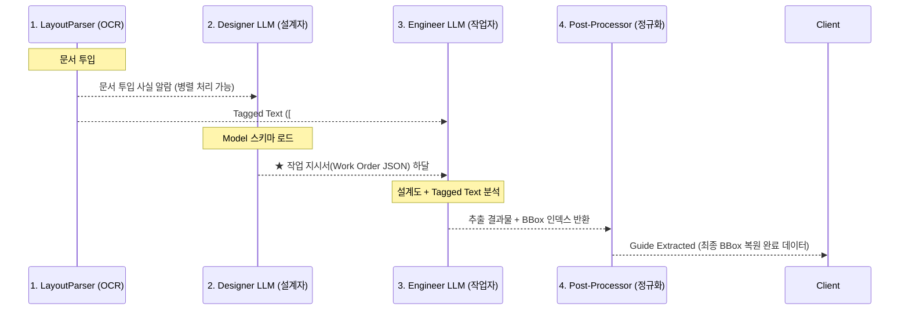

# Designer-Engineer Architecture (Two-Phase Extraction)

DAOM의 Beta 파이프라인(`beta_pipeline.py`)은 복잡한 문서(PDF, 이미지, 대용량 엑셀 등)를 처리하기 위해 단일 LLM 호출이 아닌, 역할이 분리된 둘 이상의 LLM을 조화롭게 연결하는 **설계자-엔지니어(Designer-Engineer) 패턴**을 사용합니다. 

이 문서에서는 이 파이프라인이 왜 필요한지와 내부 작동 방식을 상세히 설명합니다.

---

## 1. 개요: 2단 분리 아키텍처의 필요성

기존 단일 LLM 추출 방식은 모델이 "어떤 데이터를 뽑아야 하는지(Schema)"와 "이 방대한 텍스트의 어느 위치에 데이터가 있는지(Extraction)"를 동시에 사고해야 하므로 토큰과 컨텍스트의 낭비가 심했습니다.

**Designer-Engineer 구조**는 다음과 같은 이점을 위해 도입되었습니다:
1. **역할 물리적 격리:** JSON 스키마와 추출 규칙을 이해하는 LLM(설계자)과, 순수하게 텍스트만 스캔해서 값을 찾는 LLM(엔지니어)를 나눕니다.
2. **반복 비용 제로(Caching):** 수백 장의 문서를 반복 처리할 때, '설계자'가 한 번 만들어 둔 설계도(작업 지시서, Work Order)를 메모리에 저장해 두고 재사용하여 막대한 API 비용을 절약합니다.
3. **Hallucination 차단:** 설계자가 내려준 '엄격한 지침'에 따라 엔지니어는 데이터의 위치(인덱스 `[#123]`)만 찾게 하여 데이터 위조를 원천 방지합니다.

---

## 2. 4단계 프로세스 흐름 (Pipeline Stages)

`beta_pipeline.py`의 핵심 흐름은 크게 4단계로 구성됩니다:

### Stage 1: Layout Parsing (전처리)
* `LayoutParser` 모듈이 Azure Document Intelligence의 OCR 결과를 가져옵니다.
* 일반 띄어쓰기 텍스트를 마크다운 형태(표/문단 구조화)로 변환하며, 모든 핵심 텍스트 토큰 옆에 고유 식별 번호(`[#1]`, `[#2]`)를 부여합니다.
* 이를 **Tagged Text**라 부르며, 원래 좌표(Bounding Box)로 돌아가기 위한 지도인 **Ref Map**을 생성합니다.

### Stage 2: Designer LLM (설계자) - *캐싱 적용*
* 사용자가 등록한 Extraction Model의 정보(필드들, 글로벌 룰, 레퍼런스 데이터)를 입력받습니다.
* **업무:** 엔지니어가 쉽게 알아들을 수 있는 명확한 **'작업 지시서(Work Order JSON)'**를 생성합니다.
* **캐시 최적화:** `_work_order_cache`를 통해, 동일한 모델로 여러 문서를 추출하면 설계자는 한 번만 일하고 휴식합니다! 속도 최적화의 핵심입니다.

### Stage 3: Engineer LLM (엔지니어 작업자)
* 설계자가 넘겨준 **작업 지시서**와 LayoutParser가 만든 **Tagged Text**를 동시에 입력받습니다.
* **압도적 128k 토큰 대응:** 문서 길이가 길 경우(일반 PDF 5만자, 엑셀 30만자 이상 시), 스스로 문서를 쪼개서 읽고 합치는(Chunking) 유연함을 가집니다.
* **추출 규칙 준수:** 작업 지시서에 기반하여 결괏값의 글자 내용과 해당 글자의 꼬리표(인덱스 번호 `[#123]`)를 함께 찾아 JSON으로 제출합니다.

### Stage 4: Post-Processor (후처리 복원)
* 엔지니어 작업자는 텍스트와 꼬리표만 찾아옵니다.
* 즉각적으로 **Ref Map**을 통해 해당 꼬리표(`[#123]`)가 원본 문서 이미지 기준으로 X, Y 좌표 어디에 위치했는지(Bounding Box)를 복원해 줍니다.
* UI 화면의 PDF 뷰어에서 추출된 글자를 클릭했을 때 노란색 박스 하이라이트가 켜지는 것이 바로 여기서 복원된 좌표 덕분입니다.

---

## 3. 예외 및 Fallback 전략 (생존 능력)

해당 파이프라인에는 토큰 초과 등 예외 상황을 방어하는 다중 안전망이 갖춰져 있습니다.

* **Single-Shot 실패 시 -> Chunked Engineer 동작**
  만약 문서가 한 번에 다 읽지 못할 만큼 방대한 표여서 엔지니어 LLM이 데이터를 뱉어내다 말았을 경우(`_truncated` 플래그 발생), 즉시 **Chunked Engineer** 체제로 강등되어 거대 텍스트를 청크 단위로 잘게 나누어 병렬로 작업합니다.

* **Designer 실패 시 -> Fallback 생성**
  설계자 LLM의 응답이 불량하거나 다운되었을 시 시스템이 마비되지 않도록, 백엔드가 직접 스키마(Model Configuration)를 읽고 임시 '기본 작업 지시서'를 만들어 엔지니어에게 다이렉트로 전달합니다.

---

이러한 **모듈화 된 2단계 추론 구조** 덕분에 프롬프트가 길어져서 발생하는 오류 곡선(Context Window Degradation)을 없애고, 복잡한 인보이스와 대용량 엑셀 등의 처리를 병목 없이 정밀하게 다룰 수 있게 되었습니다.
