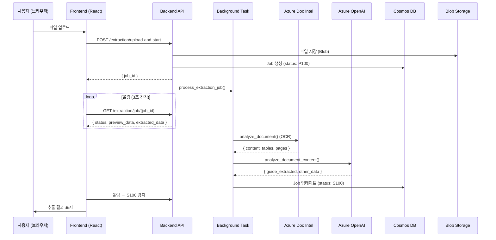

# 추출 파이프라인 데이터 플로우

> DAOM 문서 추출의 전체 데이터 흐름을 서비스 함수 + 데이터 구조 수준에서 상세 설명

---

## 1. 전체 흐름 개요



---

## 2. 단계별 상세 플로우

### 2.1 파일 업로드 & Job 시작

| 단계 | 위치 | 함수 | 설명  |
|------|------|------|-------|
| ① | Frontend | `ExtractionContext.processFile()` | File → FormData → API 호출 |
| ② | API | `start_job_with_upload()` | Blob 업로드 + Job 레코드 생성 |
| ③ | API | `process_extraction_job()` | BackgroundTask로 비동기 실행 시작 |

**파일 경로:**
- API: `backend/app/api/endpoints/extraction_preview.py` → `start_job_with_upload()`
- Service: `backend/app/services/extraction_service.py` → `run_extraction_pipeline()`

### 2.2 OCR 처리 (Document Intelligence)

```
extraction_service.run_extraction_pipeline()
  └→ doc_intel.analyze_document(file_url)
       └→ Azure Document Intelligence REST API
       └→ 반환: { content, tables, pages, paragraphs }
```

**반환 데이터 (doc_intel_output):**
```json
{
  "content": "문서 전체 텍스트 (OCR 결과)",
  "tables": [
    {
      "rowCount": 5,           // ⚠️ 없을 수 있음 → 프론트에서 cells 기반 계산 필요
      "columnCount": 3,        // ⚠️ 없을 수 있음
      "cells": [
        { "rowIndex": 0, "columnIndex": 0, "content": "셀내용", "rowSpan": 1, "columnSpan": 1 }
      ]
    }
  ],
  "pages": [
    { "pageNumber": 1, "width": 8.5, "height": 11, "words": [...] }
  ]
}
```

### 2.3 LLM 추출

```
extraction_service.run_extraction_pipeline()
  └→ _extract_single_document(doc_intel_output, model)
       └→ _unwrap_llm_extraction(...)
            └→ llm.analyze_document_content(content, ocr_result, model, ...)
                 └→ Azure OpenAI GPT-4o 호출
                 └→ JSON 파싱 → guide_extracted, other_data
```

**핵심 데이터 구조 — `guide_extracted`:**
```json
{
  "필드1_key": {
    "value": "추출된 값",
    "confidence": 0.95,
    "bbox": { "x": 0.1, "y": 0.2, "width": 0.3, "height": 0.04, "page": 1 }
  },
  "필드2_key": {
    "value": "다른 값",
    "confidence": 0.8,
    "bbox": null
  }
}
```

### 2.4 Beta 모드 추가 필드

`model.beta_features.use_optimized_prompt = true` 일 때:

```
llm.analyze_document_content()
  └→ processed_result["_beta_parsed_content"] = content_text  (LayoutParser 결과)
  └→ processed_result["_beta_ref_map"] = ref_map              (참조 맵)
```

이 값은:
1. `_unwrap_llm_extraction()` → `_validate_and_format()` 에서 보존
2. `run_extraction_pipeline()` → `preview_data.sub_documents[0].data._beta_parsed_content` 에 저장
3. Frontend `ExtractionReviewView` → `currentParsedContent` 로 접근

### 2.5 Job 저장 (최종)

```python
# extraction_service.py → run_extraction_pipeline() L306-317
extraction_jobs.update_job(
    job_id=job_id,
    status=ExtractionStatus.SUCCESS.value,     # "S100"
    preview_data=preview_payload,              # 전체 미리보기 데이터
    extracted_data=flat_extracted              # ⭐ guide_extracted 평탄화 (프론트 폴링용)
)
```

**`preview_data` (= preview_payload) 구조:**
```json
{
  "sub_documents": [
    {
      "doc_type": "main",
      "data": {
        "guide_extracted": { "필드key": { "value": "...", "confidence": 0.95 } },
        "other_data": [...],
        "_beta_parsed_content": "..."
      }
    }
  ],
  "raw_content": "OCR 전체 텍스트",
  "raw_tables": [...]
}
```

---

## 3. 프론트엔드 데이터 수신 & 소비

### 3.1 폴링 응답 구조 (GET /extraction/job/{job_id})

```json
{
  "job_id": "uuid",
  "status": "S100",
  "preview_data": { ... },
  "extracted_data": { ... },
  "error": null,
  "filename": "document.pdf",
  "file_url": "https://blob.../document.pdf",
  "log_id": "log-uuid",
  "created_at": "2026-01-01T00:00:00",
  "updated_at": "2026-01-01T00:01:00"
}
```

### 3.2 Status 코드

| 코드 | 의미 | Frontend 동작 |
|------|------|---------------|
| `P100` | Processing 시작 | 폴링 계속 |
| `P200` | OCR 완료, LLM 진행 중 | 폴링 계속 |
| `S100` | 추출 성공 | 폴링 중지 → 결과 표시 |
| `E100` | 에러 | 폴링 중지 → 에러 표시 |
| `ANALYZING` | 분석 중 (레거시) | 폴링 계속 |
| `REFINING` | 재분석 중 | 폴링 계속 |

### 3.3 데이터 → 컴포넌트 매핑

```
ExtractionContext.tsx (상태 관리)
  ├─ previewData       ← job.preview_data
  ├─ result            ← job.extracted_data
  └─ status            ← job.status

ExtractionReviewView.tsx (데이터 소비)
  ├─ rawTables           ← previewData.raw_tables
  ├─ ocrText             ← previewData.raw_content
  ├─ currentGuideExtracted ← previewData.sub_documents[0].data.guide_extracted
  ├─ currentParsedContent  ← previewData.sub_documents[0].data._beta_parsed_content
  │                          || previewData._beta_parsed_content
  └─ isBetaMode          ← model.beta_features.use_optimized_prompt

DocumentPreviewPanel.tsx  (PDF + 표 표시)
  └─ PDFViewer.tsx
       ├─ fileUrl        ← file_url
       ├─ rawTables      ← rawTables (표 렌더링)
       └─ highlights     ← highlights (bbox → 하이라이트 표시)

DataReviewPanel.tsx (추출 데이터 편집)
  ├─ guideExtracted    ← currentGuideExtracted
  ├─ otherData         ← currentOtherData
  └─ parsedContent     ← currentParsedContent (Beta 탭 조건: isBetaMode && parsedContent)
```

---

## 4. 자주 발생하는 데이터 관련 버그 패턴

### ⚠️ 패턴 1: 필드가 null / 0% 표시
**원인:** `extracted_data`가 저장 안됨 or Frontend가 잘못된 필드 참조
**점검:**
1. `extraction_service.py` → `update_job()` 호출에서 `extracted_data` 파라미터 확인
2. `ExtractionContext.tsx` 폴링 콜백에서 `data.extracted_data` 참조 확인

### ⚠️ 패턴 2: 표가 제목만 보이고 내용 없음
**원인:** `table.rowCount` / `table.columnCount`가 0 or undefined
**점검:** `PDFViewer.tsx` 에서 cells 기반 dimensions 계산 fallback 코드 확인

### ⚠️ 패턴 3: Beta 탭 안 보임
**조건:** `isBetaMode = true` AND `currentParsedContent != null`
**점검:**
1. `모델 설정` → `beta_features.use_optimized_prompt = true` 확인
2. Backend `_unwrap_llm_extraction()` → `_beta_parsed_content` 첨부 확인
3. Frontend `ExtractionReviewView.tsx` → `currentParsedContent` derivation 확인

### ⚠️ 패턴 4: 사이드바 모델 전환 시 화면 안 바뀜
**원인:** React Router가 같은 컴포넌트 재사용 → state 리셋 안됨
**해결:** `DocumentExtractionView` 에 `key={modelId}` 추가

### ⚠️ 패턴 5: 추출 완료인데 폴링 안 그침
**원인:** Frontend status 비교 코드가 맞지 않음 (예: `'completed'` vs `'S100'`)
**점검:** `ExtractionContext.tsx` 폴링 로직에서 `EXTRACTION_STATUS.SUCCESS` 상수 사용 확인
