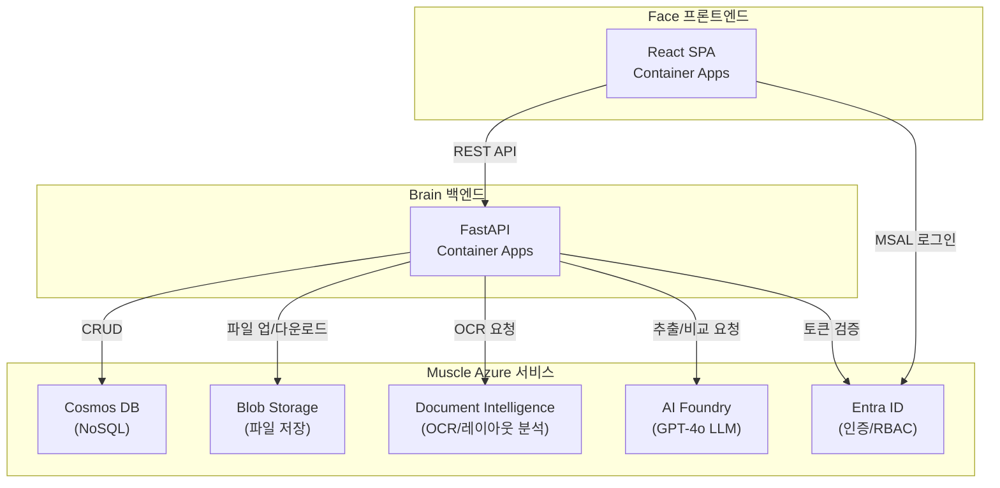
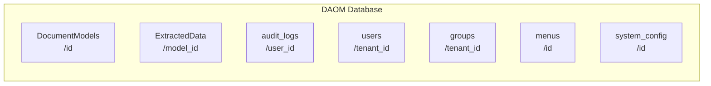
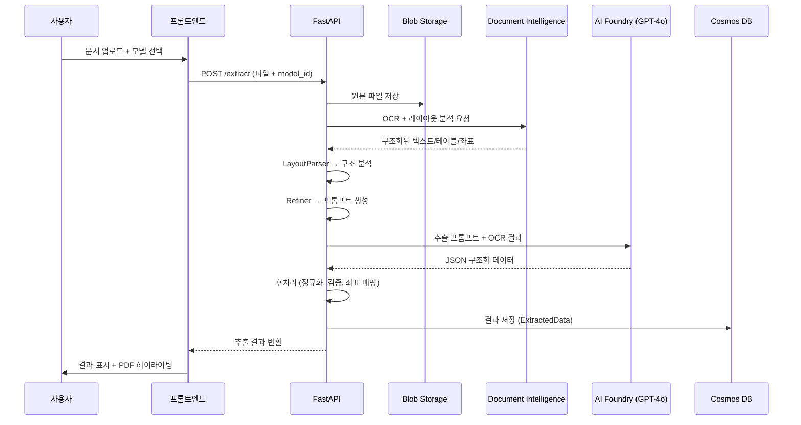

# 2. 시스템 아키텍처

> DAOM 플랫폼의 전체 시스템 구조, Azure 서비스 의존성, 핵심 데이터 흐름을 설명합니다.

---

## 🏗️ 시스템 개요

DAOM은 **문서 자동화 및 최적화 관리 플랫폼**으로, 3개의 핵심 레이어로 구성됩니다:

```
┌─────────────────────────────────────────────────────────┐
│                    🖥️ Face (Frontend)                    │
│          React 19 + Vite + TypeScript + Tailwind        │
│   SPA · 모델스튜디오 · 추출검증 · 비교분석 · 관리자     │
├─────────────────────────────────────────────────────────┤
│                    🧠 Brain (Backend)                    │
│            FastAPI + Python 3.12 + Pydantic 2           │
│   REST API · 비즈니스 로직 · 파이프라인 오케스트레이션   │
├─────────────────────────────────────────────────────────┤
│                    💪 Muscle (Azure)                     │
│  Cosmos DB · Blob Storage · Document Intelligence       │
│  AI Foundry (OpenAI) · Entra ID · Container Apps        │
└─────────────────────────────────────────────────────────┘
```

---

## ☁️ Azure 서비스 의존성



### 서비스별 역할

| Azure 서비스 | 역할 | 환경변수 |
|-------------|------|---------|
| **Cosmos DB** | 모델, 추출결과, 사용자, 감사로그 저장 | `COSMOS_ENDPOINT`, `COSMOS_KEY` |
| **Blob Storage** | 원본 문서, 이미지, 엑셀 파일 저장 | `AZURE_STORAGE_CONNECTION_STRING` |
| **Document Intelligence** | PDF/이미지 OCR, 테이블 구조 분석 | `DOC_INTEL_ENDPOINT`, `DOC_INTEL_KEY` |
| **AI Foundry (OpenAI)** | LLM 기반 데이터 추출 및 비교 분석 | `AI_FOUNDRY_ENDPOINT`, `AI_FOUNDRY_KEY` |
| **Entra ID** | SSO 인증, JWT 토큰, 테넌트 격리 | `AZURE_TENANT_ID`, `AZURE_CLIENT_ID` |
| **Container Apps** | 프론트엔드/백엔드 컨테이너 호스팅 | CI/CD에서 관리 |

---

## 📊 Cosmos DB 컨테이너 구조



| 컨테이너 | Partition Key | 용도 | 인덱싱 정책 |
|----------|--------------|------|------------|
| `DocumentModels` | `/id` | 추출 모델 정의 (필드, 규칙, 참조 데이터) | 기본 |
| `ExtractedData` | `/model_id` | 추출 결과 및 로그 | 커스텀 (composite: model_id+created_at, user_id+created_at, tenant_id+created_at) |
| `audit_logs` | `/user_id` | 감사 추적 로그 | 커스텀 (composite: tenant_id+timestamp, user_id+timestamp) |
| `users` | `/tenant_id` | 사용자 프로필 | 기본 |
| `groups` | `/tenant_id` | 사용자 그룹 | 기본 |
| `menus` | `/id` | 사이드바 메뉴 구성 | 기본 |
| `system_config` | `/id` | 시스템 전역 설정 | 기본 |

> **⚠️ 인덱싱 주의사항**: `ExtractedData`의 `preview_data`, `extracted_data`, `debug_data` 경로는 인덱싱에서 **제외**되어 RU 비용을 절감합니다. `create_container_if_not_exists`는 기존 컨테이너의 인덱스를 업데이트하지 않으므로, 인덱스 변경 시 Azure Portal이나 마이그레이션 스크립트를 사용해야 합니다.

---

## 🔄 핵심 데이터 흐름

### 문서 추출 (Extraction) 흐름



### 설정 계층 구조

설정은 다음 우선순위를 따릅니다 (**DB가 최우선**):

```
[1] Cosmos DB (system_config)     ← 최우선: 런타임에 관리자가 설정
    ↓ fallback
[2] 모델별 설정 (DocumentModels)   ← 모델 단위 오버라이드
    ↓ fallback
[3] 환경변수 (.env / Container Apps) ← 인프라 레벨 기본값
```

---

## 🔐 보안 아키텍처

### 인증 흐름

```
사용자 → Entra ID 로그인 → MSAL 토큰 발급 → 
프론트엔드 (Authorization: Bearer <token>) → 
백엔드 (JWT 검증 + tenant_id 추출) → 
DB 쿼리 (tenant_id 필터링)
```

### 핵심 보안 패턴

| 위협 | 대응 | 구현 위치 |
|------|------|----------|
| **IDOR** (직접 객체 참조) | 모든 DB 쿼리에 `tenant_id` 주입 | Repository 레이어 |
| **SSRF** (서버측 요청 위조) | URL 화이트리스트, 프라이빗 IP 차단 | `extraction_utils.py` |
| **DoS** (서비스 거부) | 스트리밍 업로드, 최대 크기 제한, Rate limiting | `slowapi`, 미들웨어 |
| **데이터 유출** | 감사 로그, 일괄 접근 감시 | `audit.py` |

---

## 📦 기술 스택 상세

### 백엔드

| 카테고리 | 기술 | 버전 |
|---------|------|------|
| 웹 프레임워크 | FastAPI | 0.128 |
| 런타임 | Python | 3.12 |
| 데이터 검증 | Pydantic | 2.12 |
| ASGI 서버 | Uvicorn | 0.40 |
| HTTP 클라이언트 | httpx | 0.28 |
| Azure SDK | azure-cosmos, azure-storage-blob, azure-ai-documentintelligence | 최신 |
| LLM 클라이언트 | openai | 2.14 |
| 이미지 처리 | opencv-python-headless, Pillow, scikit-image | 최신 |
| 문자열 비교 | Levenshtein, thefuzz | 최신 |
| Rate Limiting | slowapi | 0.1.9+ |

### 프론트엔드

| 카테고리 | 기술 | 버전 |
|---------|------|------|
| UI 라이브러리 | React | 19.2 |
| 빌드 도구 | Vite | 7.2 |
| 타입 시스템 | TypeScript | 5.9 |
| 스타일링 | Tailwind CSS | 4.1 |
| 상태관리 | TanStack Query | 5.90 |
| 라우팅 | react-router-dom | 7.11 |
| 데이터 테이블 | TanStack Table | 8.21 |
| PDF 뷰어 | react-pdf-viewer | 3.12 |
| 차트 | Recharts | 3.6 |
| 인증 | MSAL React | 3.0 |
| 다국어 | i18next + react-i18next | 25.7 / 16.5 |
| UI 프리미티브 | Radix UI (dialog, dropdown, tabs, ...) | 최신 |
| 애니메이션 | Framer Motion | 12.23 |
| 아이콘 | Lucide React, Phosphor Icons | 최신 |

---

**다음**: [03. 백엔드 가이드](03-backend.md)에서 서비스 레이어와 API 구조를 상세하게 살펴봅니다.
