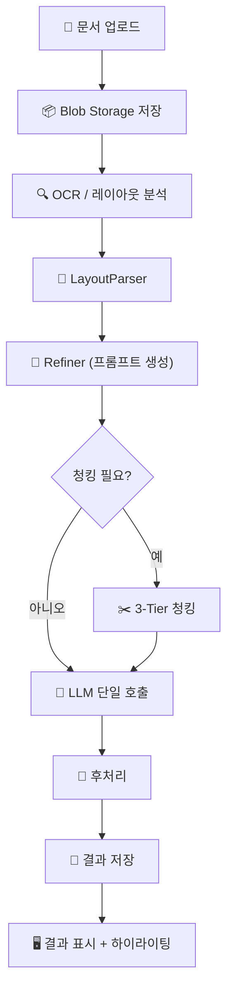
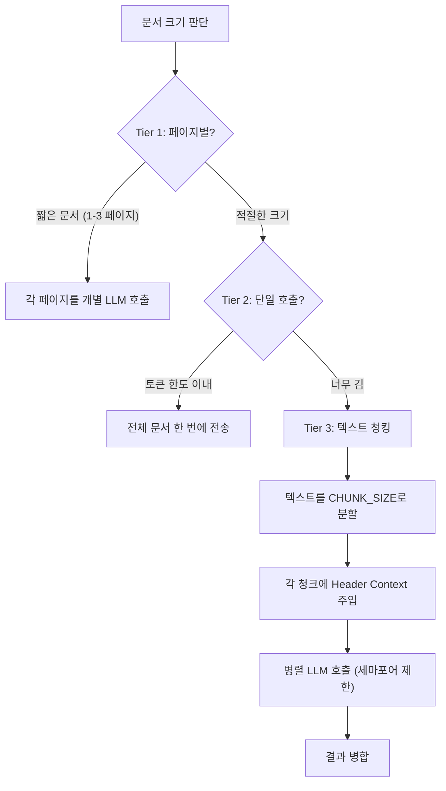
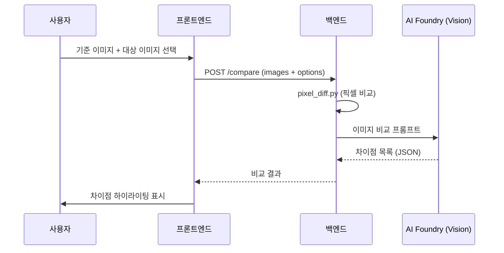

# 5. 추출 파이프라인

> DAOM의 핵심 기능인 문서 데이터 추출의 전체 흐름을 단계별로 설명합니다.

---

## 🔄 파이프라인 전체 흐름



---

## 📋 단계별 상세

### Stage 1: 문서 업로드

사용자가 PDF, 이미지, 엑셀 파일을 업로드합니다.

```
POST /api/v1/extract
Content-Type: multipart/form-data

- file: 원본 문서
- model_id: 사용할 추출 모델 ID
- options: { quick: false, beta: true }
```

- 파일은 **스트리밍 업로드**로 메모리 부족 방지
- 최대 크기: `MAX_UPLOAD_SIZE` (기본 50MB)
- 파일은 Azure Blob Storage에 저장 후 URL 참조

### Stage 2: OCR / 레이아웃 분석

`doc_intel.py`가 Azure Document Intelligence를 호출합니다.

| 기능 | 설명 |
|------|------|
| **텍스트 추출** | 전체 문서의 텍스트를 인식 |
| **테이블 구조** | 셀 단위로 행/열 구조를 파악 |
| **좌표 매핑** | 각 텍스트/테이블의 바운딩 박스 좌표 추출 |
| **페이지별 분류** | 멀티페이지 문서의 페이지별 콘텐츠 분류 |

**반환 데이터 구조:**

```json
{
  "content": "전체 텍스트...",
  "pages": [ ... ],
  "paragraphs": [ ... ],
  "tables": [
    {
      "rowCount": 10,
      "columnCount": 5,
      "cells": [
        { "rowIndex": 0, "columnIndex": 0, "content": "상품명", "boundingRegions": [...] }
      ]
    }
  ]
}
```

### Stage 3: LayoutParser

`layout_parser.py` (20KB)가 OCR 결과를 **구조화된 텍스트**로 변환합니다.

#### Index-Reference 패턴

테이블 데이터를 LLM에 효율적으로 전달하기 위한 핵심 패턴:

```
[TABLE_1]
| 상품명 | 등급 | 요율 |
|--------|------|------|
| A상품  | 1등급 | 1.5  |
| B상품  | 2등급 | 2.3  |

[TABLE_2]
| 연령대 | 남성 | 여성 |
|--------|------|------|
| 20-30  | 1.2  | 1.1  |
```

- 테이블에 인덱스(`TABLE_1`, `TABLE_2`)를 부여
- LLM이 특정 테이블을 참조할 수 있게 함
- 토큰 사용량을 최소화

### Stage 4: Refiner (프롬프트 생성)

`refiner.py` (9KB)가 추출 프롬프트를 구성합니다:

```
[시스템 프롬프트]
당신은 문서에서 구조화된 데이터를 추출하는 전문가입니다.

[모델 전역 규칙]
{model.global_rules}

[필드 정의]
다음 필드를 추출하세요:
- premium_rate (테이블): 프리미엄 요율 테이블
  - age_group (텍스트): 연령대
  - rate (숫자): 요율 값

[참조 데이터]
{model.reference_data}

[문서 내용]
{layoutparser_output}

[출력 형식]
JSON 형식으로 응답하세요. 키는 반드시 영어 원본을 유지하세요.
```

### Stage 5: 3-Tier 청킹

`beta_chunking.py` (36KB)가 대용량 문서를 처리합니다.



#### Header Context Injection (핵심 패턴)

```python
# 첫 800자를 헤더 컨텍스트로 추출
header_context = full_content[:800]

# 두 번째 이후 청크에 주입
if chunk_idx > 0:
    final_chunk = header_context + "\n... [Header Context End] ...\n" + chunk_text
```

**왜 필요한가?**
- 대용량 문서의 후반부 청크는 테이블 헤더 정보가 없음
- LLM이 컬럼 의미를 추론할 수 없어 추출 실패
- 헤더 컨텍스트를 주입하면 모든 청크에서 스키마를 인식

### Stage 6: LLM 호출

`llm.py` (37KB)가 Azure AI Foundry (GPT-4o)를 호출합니다.

| 파라미터 | 기본값 | 설명 |
|---------|--------|------|
| `model` | `gpt-4o` | 사용 모델 |
| `max_tokens` | 4096 | 최대 출력 토큰 |
| `temperature` | 0.1 | 응답 다양성 (낮을수록 일관적) |
| `response_format` | `json_object` | JSON 출력 강제 |

**토큰 사용량 추적:**
```json
{
  "prompt_tokens": 3500,
  "completion_tokens": 1200,
  "total_tokens": 4700,
  "model": "gpt-4o-2024-12-01",
  "cost_estimate_usd": 0.038
}
```

### Stage 7: 후처리

추출 결과를 정규화하고 검증합니다:

| 처리 | 설명 |
|------|------|
| **Dict-as-List 정규화** | `{"0": {...}, "1": {...}}` → `[{...}, {...}]` |
| **필드 키 검증** | LLM이 필드명을 번역한 경우 원본 키로 복원 |
| **좌표 매핑** | 추출 값 → OCR 바운딩 박스 좌표 매핑 |
| **신뢰도 계산** | 각 필드의 추출 신뢰도 점수 계산 |
| **데이터 확장** | 비즈니스 로직 적용 (할증, 조합 계산 등) |

#### guide_extracted 래퍼

모든 추출 결과는 이 형식으로 저장됩니다:

```json
{
  "guide_extracted": {
    "field_key_1": "value_1",
    "table_field": [
      { "col1": "val1", "col2": "val2" },
      { "col1": "val3", "col2": "val4" }
    ]
  }
}
```

> **⚠️ 이 계약을 반드시 준수하세요.** 프론트엔드의 `ExtractionContext`와 모든 결과 렌더링 컴포넌트는 `guide_extracted` 키의 존재를 가정합니다.

---

## 🧪 Beta 기능 시스템

`ExtractionModel.beta_features`로 실험적 기능을 제어합니다:

| 플래그 | 설명 |
|--------|------|
| `use_optimized_prompt` | 최적화된 프롬프트 사용 |
| `use_virtual_excel_ocr` | 엑셀 파일의 가상 OCR 활성화 |

### Beta 데이터 흐름

```
모델 설정 (beta_features) → 백엔드 (beta_pipeline.py) → 
결과에 _beta_parsed_content, _beta_ref_map 포함 → 
프론트엔드 (Beta 탭에서 표시)
```

---

## 📊 비교 파이프라인 (Comparison)

문서/이미지 비교 분석 흐름:



### 비교 옵션

| 옵션 | 설명 |
|------|------|
| `sensitivity` | 감도 (low/medium/high) |
| `categories` | 비교 카테고리 (텍스트, 숫자, 이미지, 레이아웃) |
| `custom_ignore_rules` | 무시 규칙 (특정 영역, 패턴 제외) |
| `confidence_threshold` | 신뢰도 임계값 |

---

## 🔧 파이프라인 디버깅

### Debug Modal

프론트엔드에서 추출 로그의 `debug_data`를 확인할 수 있습니다:

```json
{
  "prompt_sent": "실제 전송된 프롬프트 전문...",
  "raw_response": "LLM 원본 응답...",
  "processing_steps": ["ocr", "layout_parse", "refine", "llm_call", "normalize"],
  "token_usage": { ... },
  "errors": []
}
```

### 추출 실패 점검 순서

```
1. debug_data.prompt_sent → 프롬프트가 올바른지 확인
2. debug_data.raw_response → LLM 응답이 유효한 JSON인지 확인
3. token_usage → 토큰 한도 초과 여부 확인
4. extracted_data → guide_extracted 래퍼 존재 확인
5. 좌표 데이터 → bbox 매핑이 올바른지 확인
```

---

## 📌 파이프라인 관련 핵심 규칙

| 규칙 | 설명 |
|------|------|
| **guide_extracted 필수** | 모든 추출 결과는 이 래퍼 안에 |
| **영어 필드 키 유지** | LLM이 필드명을 번역하면 안 됨 |
| **Dict-as-List 변환** | `{"0": x, "1": y}` → `[x, y]` 자동 변환 |
| **Header Context** | 2번째 이후 텍스트 청크에 헤더 주입 |
| **세마포어 동시성** | `EXTRACTION_CONCURRENCY` 이상 병렬 호출 금지 |
| **토큰 추적** | 모든 LLM 호출에 `token_usage` 기록 |

---

**다음**: [06. 관리자 기능](06-admin-features.md)에서 모델 관리, 사용자 관리, RBAC 시스템을 다룹니다.
