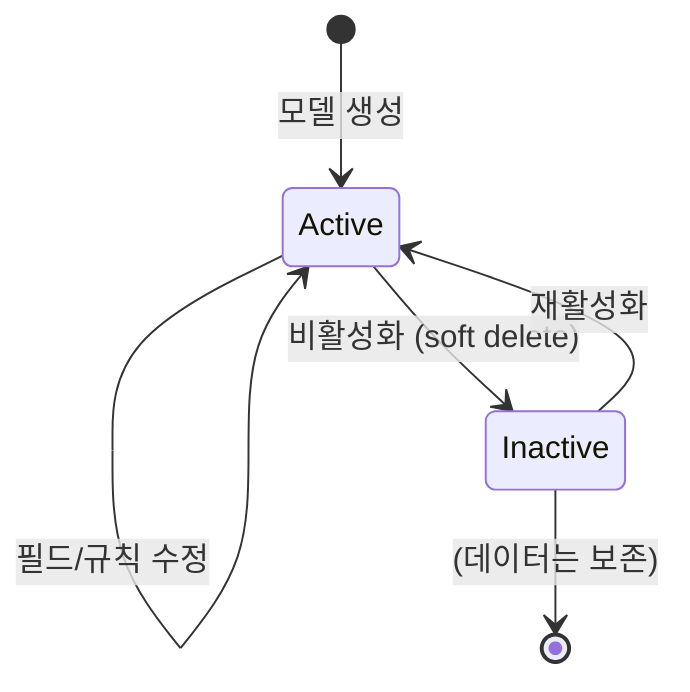

# 6. 관리자 기능

> 모델 관리, 사용자/그룹 관리, RBAC 권한 체계, 감사 로그 시스템을 설명합니다.

---

## 🎯 모델 관리 (Model Studio)

### 모델 생명주기



> **Soft Delete**: 모델 삭제 시 `is_active: false`로 설정하며, 실제로 제거하지 않습니다. 과거 추출 로그와의 참조 무결성을 유지하기 위함입니다.

### 모델 구성 요소

| 구성 요소 | 설명 | 관련 서비스 |
|----------|------|------------|
| **필드 정의** (Fields) | 추출할 데이터 필드 목록. 중첩 테이블 필드 지원 | `models.py` |
| **전역 규칙** (Global Rules) | LLM에 전달할 추출 지침 (텍스트) | `prompt_service.py` |
| **참조 데이터** (Reference Data) | 코드표, 매핑 테이블 등 참조 정보 | `models.py` |
| **Beta 기능** (Beta Features) | 실험적 기능 토글 | `beta_pipeline.py` |

### 필드 정의 (FieldDefinition)

```json
{
  "key": "premium_rate",          // 영어 필드 키 (API/DB에서 사용)
  "label": "프리미엄 요율",        // UI 표시명
  "type": "table",                 // text | number | date | table | image
  "description": "요율 테이블",    // LLM 참고 설명
  "required": true,
  "children": [                    // type=table일 때 하위 컬럼
    { "key": "age_group", "label": "연령대", "type": "text" },
    { "key": "rate", "label": "요율", "type": "number" }
  ]
}
```

### 필드 타입별 동작

| 타입 | LLM 추출 방식 | UI 표시 |
|------|-------------|---------|
| `text` | 단일 텍스트 값 | 편집 가능한 텍스트 필드 |
| `number` | 숫자 값 (정규화 적용) | 숫자 입력 |
| `date` | 날짜 값 | 날짜 표시 |
| `table` | 테이블 데이터 (행 배열) | `DeepTable` 컴포넌트 |
| `image` | 이미지 영역 추출 | 이미지 미리보기 |

---

## 👥 사용자 관리

### 사용자 모델

```json
{
  "id": "user-uuid",
  "tenant_id": "tenant-uuid",
  "email": "user@company.com",
  "display_name": "홍길동",
  "role": "user",                  // admin | manager | user | viewer
  "groups": ["group-1", "group-2"],
  "is_active": true,
  "pre_registered": false,         // 사전 등록 여부
  "created_at": "2026-01-15T..."
}
```

### 사용자 관리 기능

| 기능 | API | 설명 |
|------|-----|------|
| 목록 조회 | `GET /users` | 테넌트 내 전체 사용자 |
| 사용자 생성 | `POST /users` | 개별 사용자 등록 |
| 대량 가져오기 | `POST /users/bulk-import` | CSV/Excel 일괄 등록 |
| 사전 등록 | `POST /users/pre-register` | 로그인 전 권한 사전 설정 |
| 수정 | `PUT /users/{id}` | 역할, 그룹 변경 |
| 비활성화 | `DELETE /users/{id}` | Soft delete |

### 대량 가져오기 (Bulk Import)

`BulkUserImport.tsx` (8KB)에서 CSV/Excel 파일로 사용자를 일괄 등록:

```
이메일,이름,역할,그룹
user1@company.com,김철수,user,그룹A
user2@company.com,이영희,manager,그룹A;그룹B
```

---

## 🔐 RBAC (역할 기반 접근 제어)

### 역할 체계

| 역할 | 모델 관리 | 추출 실행 | 로그 조회 | 사용자 관리 | 설정 변경 |
|------|----------|----------|----------|------------|----------|
| `admin` | ✅ 전체 | ✅ | ✅ 전체 | ✅ | ✅ |
| `manager` | ✅ 소속 그룹 | ✅ | ✅ 소속 그룹 | ✅ 제한적 | ❌ |
| `user` | 👁️ 읽기만 | ✅ | ✅ 본인 | ❌ | ❌ |
| `viewer` | 👁️ 읽기만 | ❌ | ✅ 본인 | ❌ | ❌ |

### 권한 해결 로직

`permission_service.py`에서 처리:

```python
def resolve_permissions(user, resource):
    # 1. 관리자(Admin)는 모든 것에 접근 가능
    if user.role == "admin":
        return ALL_PERMISSIONS
    
    # 2. 소속 그룹의 모델에만 접근
    user_groups = get_user_groups(user.id)
    model_groups = get_model_groups(resource.model_id)
    
    if not user_groups.intersection(model_groups):
        raise PermissionDenied()
    
    # 3. 역할별 세부 권한 적용
    return ROLE_PERMISSIONS[user.role]
```

### 그룹 관리

| 기능 | 설명 |
|------|------|
| 그룹 생성/수정/삭제 | CRUD 기본 관리 |
| 모델-그룹 연결 | 특정 그룹에 모델 접근 권한 부여 |
| 사용자-그룹 연결 | 사용자를 그룹에 배정 |
| 메뉴 가시성 | 그룹에 따라 사이드바 메뉴 표시/숨김 |

---

## 📝 감사 로그 (Audit Trail)

### 감사 로그 구조

```json
{
  "id": "audit-uuid",
  "user_id": "user-uuid",        // partition key
  "tenant_id": "tenant-uuid",
  "action": "model.update",       // 작업 유형
  "resource_type": "model",       // 리소스 종류
  "resource_id": "model-uuid",
  "changes": {                    // 변경 전후
    "before": { "name": "old" },
    "after": { "name": "new" }
  },
  "details": { ... },             // 추가 컨텍스트
  "ip_address": "1.2.3.4",
  "timestamp": "2026-02-09T..."
}
```

### 추적 대상 이벤트

| 카테고리 | 이벤트 |
|---------|--------|
| **모델** | 생성, 수정, 삭제(비활성화), 필드 변경 |
| **추출** | 추출 요청, 완료, 실패, 결과 편집 |
| **사용자** | 생성, 역할 변경, 대량 가져오기, 삭제 |
| **그룹** | 생성, 수정, 멤버 변경, 모델 연결 변경 |
| **설정** | 시스템 설정 변경, 메뉴 구성 변경 |
| **일괄 접근** | 대량 데이터 다운로드, 대량 삭제 |

### 토큰 사용량 감사

`token_audit.py`에서 LLM API 호출의 토큰 사용량을 추적:

```json
{
  "total_tokens": 4700,
  "prompt_tokens": 3500,
  "completion_tokens": 1200,
  "model": "gpt-4o",
  "cost_estimate_usd": 0.038,
  "user_id": "user-uuid",
  "model_id": "model-uuid"
}
```

---

## ⚙️ 사이트 설정

### 시스템 설정 (`system_config`)

관리자가 UI에서 변경 가능한 런타임 설정:

| 설정 | 기본값 | 설명 |
|------|--------|------|
| LLM 모델 | `gpt-4o` | 추출에 사용할 LLM |
| 최대 토큰 | 4096 | LLM 출력 토큰 한도 |
| Temperature | 0.1 | LLM 응답 다양성 |
| 청킹 크기 | 5000 | 텍스트 청크 크기 |
| 동시 처리 수 | 3 | 병렬 추출 작업 수 |

### 메뉴 관리

`menu_service.py`에서 사이드바 메뉴 구성:

```json
{
  "id": "menu-config",
  "items": [
    { "key": "models", "label": "모델 관리", "icon": "database", "visible": true },
    { "key": "users", "label": "사용자 관리", "icon": "users", "visible": true, "admin_only": true },
    { "key": "audit", "label": "감사 로그", "icon": "shield", "visible": true, "admin_only": true }
  ]
}
```

---

**다음**: [07. 배포 가이드](07-deployment.md)에서 CI/CD 파이프라인과 Azure 배포를 다룹니다.
