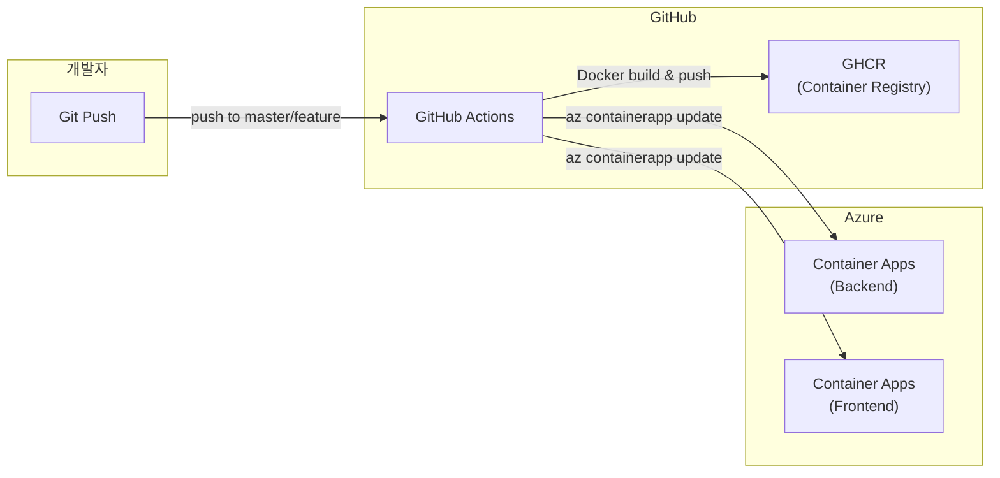
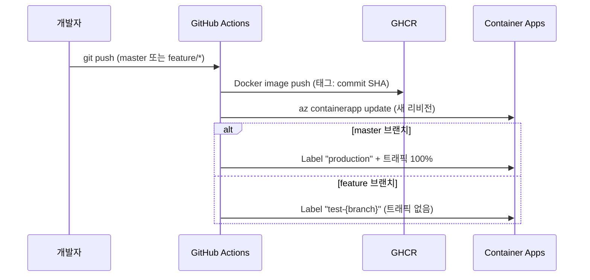

# 7. 배포 가이드

> CI/CD 파이프라인, Docker 빌드, Azure Container Apps 배포 과정을 설명합니다.

---

## 🏗️ 배포 아키텍처



---

## 📦 Docker 이미지

### 백엔드 Dockerfile

```dockerfile
FROM python:3.12-slim
WORKDIR /app

# 시스템 의존성 (OpenCV 등)
RUN apt-get update && apt-get install -y --no-install-recommends \
    build-essential libglib2.0-0 libxcb1 \
    && rm -rf /var/lib/apt/lists/*

COPY requirements.txt .
RUN pip install --no-cache-dir -r requirements.txt
COPY . .

EXPOSE 8000
CMD ["uvicorn", "main:app", "--host", "0.0.0.0", "--port", "8000"]
```

### 프론트엔드 Dockerfile (멀티스테이지)

```dockerfile
# Build Stage
FROM node:20-slim AS build
WORKDIR /app
ARG VITE_API_BASE_URL=https://daom-backend.greenpebble-00aa1dc4.koreacentral.azurecontainerapps.io/api/v1
ARG VITE_AZURE_TENANT_ID
ENV VITE_API_BASE_URL=$VITE_API_BASE_URL
ENV VITE_AZURE_TENANT_ID=$VITE_AZURE_TENANT_ID

COPY package*.json ./
RUN npm install
COPY . .
ENV NODE_OPTIONS="--max-old-space-size=4096"
RUN npm run build

# Production Stage
FROM nginx:alpine
COPY --from=build /app/dist /usr/share/nginx/html
COPY nginx.conf /etc/nginx/conf.d/default.conf
EXPOSE 80
CMD ["nginx", "-g", "daemon off;"]
```

> **⚠️ 주의**: 프론트엔드는 **빌드 시점에** 환경변수가 주입됩니다 (`VITE_` 접두사). 배포 후 변경하려면 재빌드가 필요합니다.

---

## 🔄 CI/CD 파이프라인

### GitHub Actions 워크플로우

| 워크플로우 | 트리거 | 용도 |
|-----------|--------|------|
| `deploy-backend.yml` | `master`, `feature/*` push + `backend/` 변경 | 프로덕션/테스트 백엔드 배포 |
| `deploy-frontend.yml` | `master`, `feature/*` push + `frontend/` 변경 | 프로덕션/테스트 프론트엔드 배포 |
| `deploy-test-backend.yml` | 수동 트리거 | 테스트 환경 백엔드 |
| `deploy-test-frontend.yml` | 수동 트리거 | 테스트 환경 프론트엔드 |

### 배포 흐름 (deploy-backend.yml)

```
1. Checkout → 2. Docker Build & Push (GHCR) → 3. Azure Login → 4. Container App Update
```

#### Multi-Revision 배포 전략



**핵심 포인트:**
- `master` 배포: 자동으로 프로덕션 트래픽 100% 전환
- `feature/*` 배포: 테스트 리비전 생성 (트래픽 없음, 라벨로 접근)
- 이미지 태그: commit SHA의 처음 7자 사용

### 환경변수 관리

| 환경 | 설정 방법 |
|------|----------|
| **로컬** | `.env` 파일 |
| **GitHub Actions** | Repository Secrets |
| **Azure Container Apps** | 환경변수 설정 (az cli / Portal) |

#### 필수 GitHub Secrets

| Secret | 용도 |
|--------|------|
| `AZURE_CREDENTIALS` | Azure Service Principal JSON |
| `GITHUB_TOKEN` | GHCR 인증 (자동 제공) |

---

## 🎯 수동 배포

### 백엔드

```bash
# 1. Docker 빌드
cd backend
docker build -t daom-backend:latest .

# 2. 로컬 테스트
docker run -p 8000:8000 --env-file .env daom-backend:latest

# 3. GHCR에 푸시
docker tag daom-backend:latest ghcr.io/<org>/daom/backend:latest
docker push ghcr.io/<org>/daom/backend:latest

# 4. Azure Container Apps 업데이트
az containerapp update \
  --name daom-backend \
  --resource-group Dalle2 \
  --image ghcr.io/<org>/daom/backend:latest
```

### 프론트엔드

```bash
# 1. Docker 빌드 (환경변수 주입)
cd frontend
docker build \
  --build-arg VITE_API_BASE_URL=https://your-backend-url/api/v1 \
  --build-arg VITE_AZURE_TENANT_ID=your-tenant-id \
  -t daom-frontend:latest .

# 2. 로컬 테스트
docker run -p 80:80 daom-frontend:latest

# 3. GHCR → Container Apps 배포 (백엔드와 동일 과정)
```

---

## 🌐 Azure 리소스 구성

| 리소스 | 리소스 그룹 | 리전 |
|--------|------------|------|
| Container Apps 환경 | `Dalle2` | Korea Central |
| Backend Container App | `daom-backend` | Korea Central |
| Frontend Container App | `daom-frontend` | Korea Central |
| Cosmos DB | (별도 관리) | Korea Central |
| Blob Storage | (별도 관리) | Korea Central |
| Document Intelligence | (별도 관리) | Korea Central |
| AI Foundry | (별도 관리) | Korea Central |
| Entra ID | (전역) | 전역 |

---

## ✅ 배포 전 체크리스트

### 백엔드

- [ ] `py_compile` 통과 (`python -m py_compile main.py`)
- [ ] 모든 import 정상 (`python -c "from app.api.api import api_router"`)
- [ ] 환경변수 누락 없음 (필수: COSMOS, DOC_INTEL, AI_FOUNDRY)
- [ ] `requirements.txt` 업데이트 (새 패키지 추가 시)
- [ ] API 변경 사항 문서화

### 프론트엔드

- [ ] TypeScript 빌드 통과 (`npx tsc --noEmit`)
- [ ] Vite 빌드 통과 (`npm run build`)
- [ ] 사용하지 않는 import 제거
- [ ] 환경변수 확인 (`VITE_API_BASE_URL`, `VITE_AZURE_TENANT_ID`)
- [ ] i18n 번역 키 추가 확인

### 공통

- [ ] CORS 설정 확인
- [ ] 새 컨테이너 인덱싱 정책 적용 여부 확인
- [ ] 감사 로그 기록 동작 확인
- [ ] Rate limiting 설정 확인

---

**다음**: [08. 트러블슈팅](08-troubleshooting.md)에서 자주 발생하는 문제와 해결 방법을 다룹니다.
